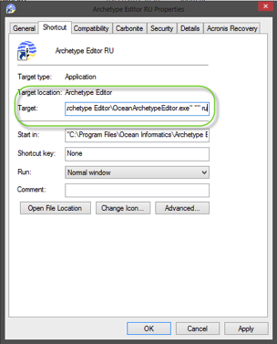
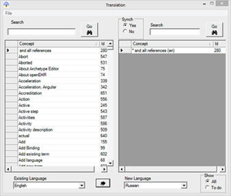
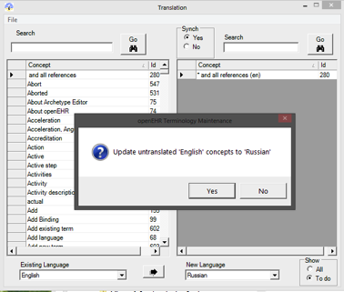
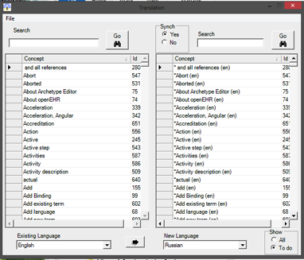

# openEHR Clinical modelling Tools Internationalisation

Both the Archetype Editor and Template Designer can be setup to work with different native languages.

### Setting the startup language

The Archetype Editor will default to the native Windows language on startup. You can override this behaviour. Forcing it to startup in a specific language by adding a command-line parameter.

1. Create a Windows Shortcut to the ArchetypeEditor.exe, normally at

``C:\Program Files\openEHR\Archetype Editor`` on Windows-32 systems
``C:\Program Files(x86)\openEHR\Archetype Editor`` on Windows-64 systems

2. Add an empty parameter "" to the command line

Add an iso-639-1 2 character language code to the command line.
[Wikipedia: List of ISO 639-1codes](http://en.wikipedia.org/wiki/List_of_ISO_639-1_codes)

e.g.
for British English…
``”C:\Program Files\openEHR\Archetype Editor\ArchetypeEditor.exe" en-gb``

for Russian…
``”C:\Program Files\openEHR\Archetype Editor\ArchetypeEditor.exe” ru``

### **Archetype Editor – Internationalisation**

The GUI (menus, labels, buttons etc) of the Archetype Editor may be internationalised as follows…

1. Navigate to the install folder of the Archetype Editor (normally 
``C:\Program Files\openEHR\Archetype Editor`` on Windows-32 systems
``C:\Program Files(x86)\openEHR\Archetype Editor`` on Windows-64 systems
2. Go to the Terminology folder ``C:\Program Files\openehr\Archetype Editor\Terminology`` and run the openEHR_Translation.exe tool
 
3. Select English as the primary language
4. Select the secondary language e.g. Russian, German …

5. Select the ‘Todo’ radio-button and then select ‘Yes’ when asked if you wish to “Update untranslated English concepts”. 
 

6. The right hand list will fill with ‘dummy translations’, beginning with an asterix and ending with (en) e.g. “*Abort (en)” 
 

7. Change each of the dummy translations to the correct secondary language equivalent. As you do so they will disappear from the ‘New Language’ list.
8. When you close the Translation application, make sure that you save the changes. You can save any interim changes and come back to complete the translations later.
9. Any saved changes should appear when you start up the Archetype Editor in the new language.

When you have completed the translation, please send the ‘terminology.xml’ file in the Archetype Editor\Terminology folder to [Ian McNicoll](mailto:ian.mcnicoll@openehr.org) or [Heather Leslie](mailto:heather.leslie@oceaninformatics.com) so that it can be incorporated into the next version of the Archetype Editor release.

### Template Designer Language setup

 At start-up the Template Designer will default to the native Windows language. To set it up to run in a specific language:

1. Create Shortcut to the TemplateDesigner.exe, normally at

     C:\Program Files\Ocean Informatics\Template Designer\TemplateDesigner.exe

2. Change the Target to include a /l??-?? Language-COUNTRY code, supported by .Net Framework see [.NET Country codes](http://msdn.microsoft.com/en-us/goglobal/bb896001.aspx)

     e.g.

          British English

          Target = "C:\Program Files\Ocean Informatics\

Template Designer\TemplateDesigner.exe" /l:en-GB

          Russian

Target = "C:\Program Files\Ocean Informatics\

Template Designer \TemplateDesigner.exe" /l:ru

#### Template Designer - Internationalisation

The Template Designer application GUI can be internationalised but requires the new language to be compiled by the development team.

To add a new language, contact Ocean Informatics.
